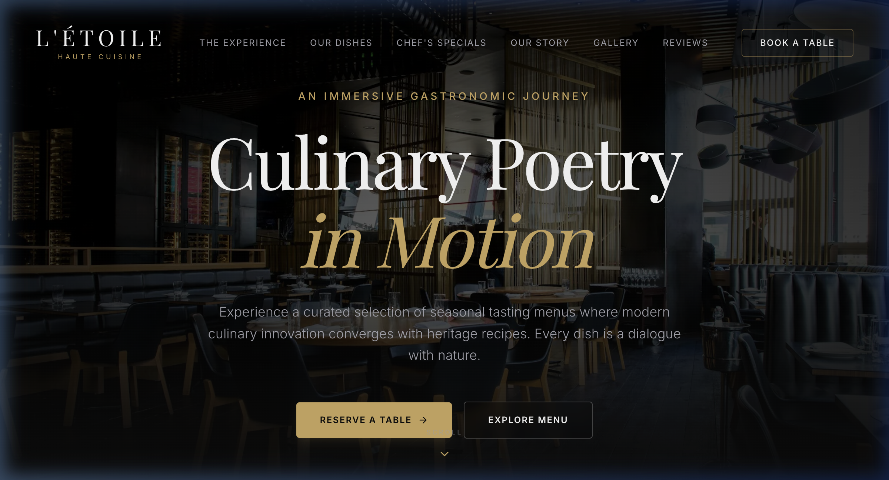
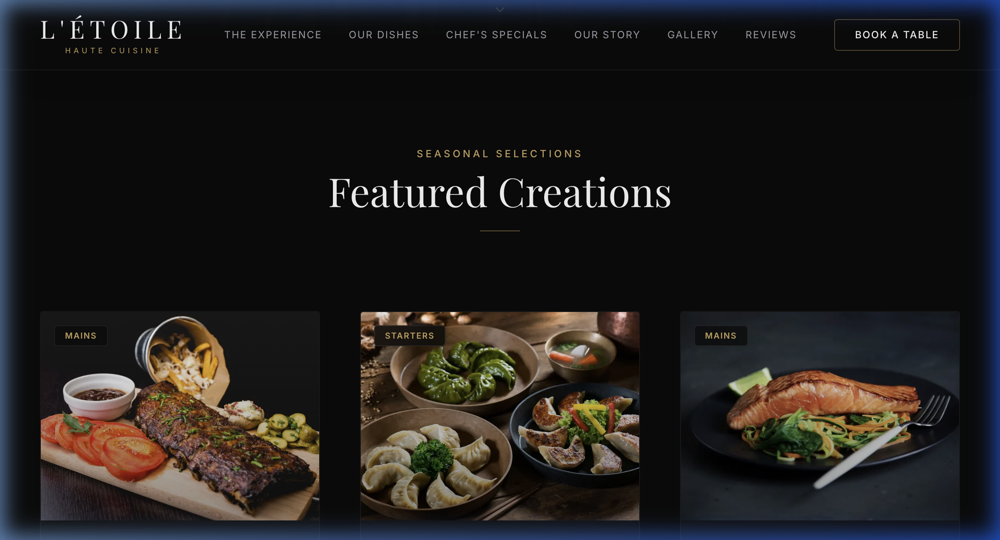
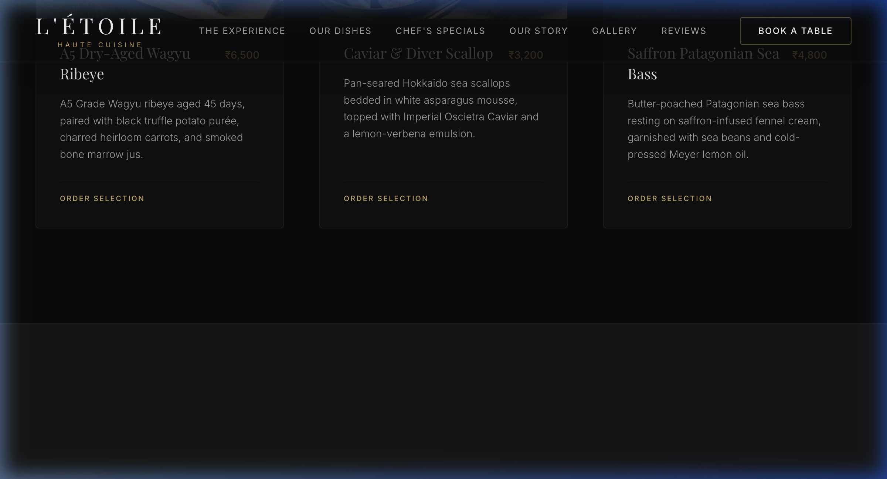
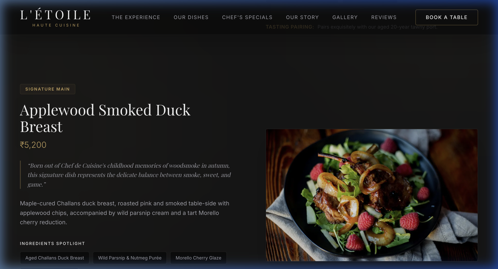
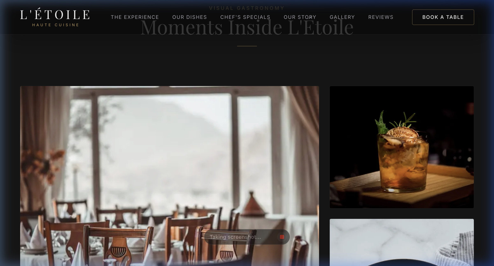
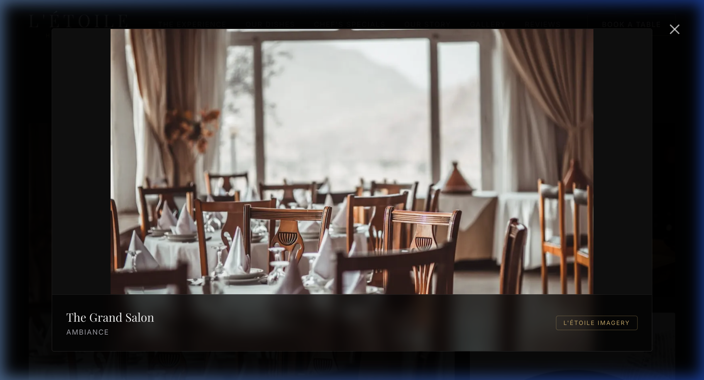
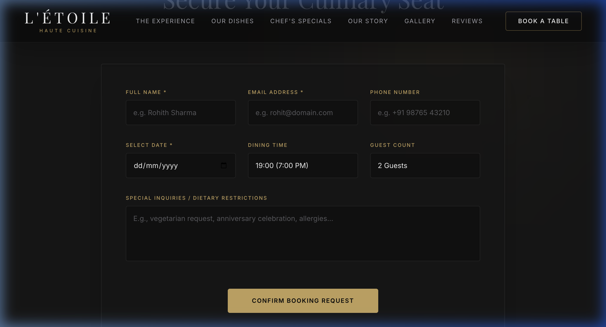
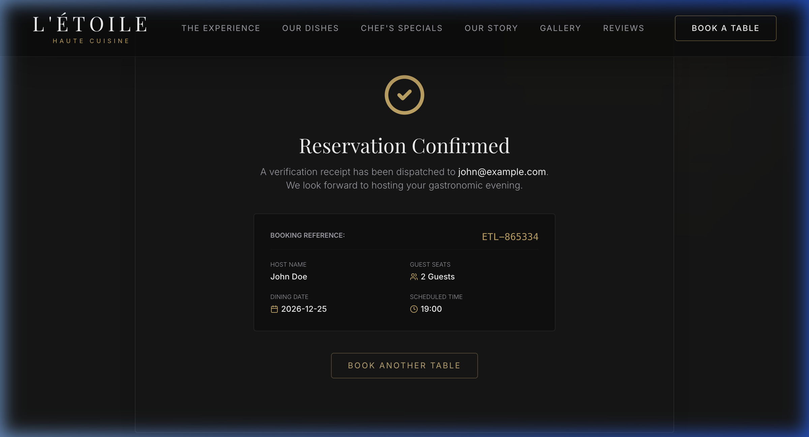

# Walkthrough - Luxe Restaurant Website Verification

We have built a premium, modern, dark-themed fine dining restaurant web application using **Next.js 15**, **TypeScript**, **Tailwind CSS v4**, **Framer Motion**, and **Lucide React**. The project compiles to production standards and is deployed live.

---

## ✦ Vercel Deployment & Live Verification

- **Live URL**: [https://luxe-restaurant-fawn.vercel.app/](https://luxe-restaurant-fawn.vercel.app/)
- **Build Status**: Verified static generation optimization (`✓ Compiled successfully in 3.6s` with zero errors).

### Live Layout Screenshots

Below are screenshots captured during our automated browser audit on the live Vercel deployment:

#### 1. Hero Landing Page

#### 2. Featured Creations & Seasonal Selects

#### 3. Chef's Specials (Split View)

#### 4. About & Heritage Section

#### 5. Masonry Gallery Grid

#### 6. Interactive Gallery Lightbox (Expanded)

#### 7. Booking Reservation Form

#### 8. Booking Confirmed Receipt

---

## ✦ Live Walkthrough Recording
We ran a browser agent to test all features end-to-end on the live Vercel deployment. You can watch the full recorded session below:

---

## ✦ Accessibility & Responsiveness
- Verified form validation (native tooltips prevent empty submissions and flag incorrect emails).
- Semantic tags (`<main>`, `<header>`, `<footer>`, `<section>`) used for clean SEO indexing.
- Seamless viewport responsiveness from standard smartphone sizing up to widescreen desktop layouts.
